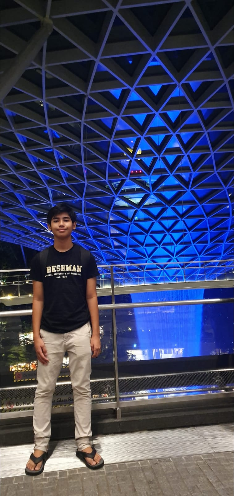
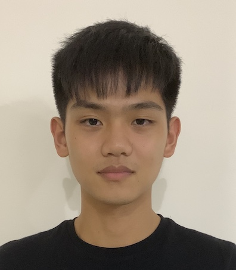

We are a team based in the [School of Computing, National University of Singapore](http://www.comp.nus.edu.sg).

We are looking for a good internships!  
You can reach our supervisor at `damithc[at]comp.nus.edu.sg`

## Project team

### Dhafin Razaq Oktoyuzan

[[github](https://github.com/dhafinrazaq)][[Project Portfolio Page (PPP)](team/dhafinrazaq)]

#### Developer & Deliverables in-charge

* Ensure project deliverables are done on time and in the right format.

---

### Bennett Clement

[[github](https://github.com/benclmnt)][[Project Portfolio Page (PPP)](team/benclmnt)]

#### Developer & Code Quality in-charge

* Looks after code quality, ensures adherence to coding standards within the project.

---

### Maguire Ong

[[github](http://github.com/maguireong)][[Project Portfolio Page (PPP)](team/maguireong)]

#### Developer & Integration in-charge

* In charge of versioning of the code, maintaining the code repository, integrating various parts of the software to create a whole.

---

### Kelvin Wong Jian Quan

[[github](http://github.com/kelvinvin)][[Project Portfolio Page (PPP)](team/kelvinvin)]

#### Developer & Documentation in-charge

* Responsible for the quality of various project documents.

---

### Tan Wei Jie

[[github](http://github.com/tanweijie123), [Project Portfolio Page (PPP)](team/tanweijie123)]

#### Developer & UI in-charge

* Ensures the UI is designed and integrated properly. 
