Welcome to FitEgo! This document will serve as a developer guide to the all-in-one scheduling application. This is to encourage and guide interested parties who wish to extend FitEgo and improve its features.

Made with **fitness instructors** in mind, **FitEgo** is a **desktop program** that helps them **manage their clients and schedules**, optimized for use via a Command Line Interface (CLI) while still having the benefits of a Graphical User Interface (GUI). If you can type fast, **FitEgo** can get your client management tasks done faster than traditional GUI apps.

## Table of Contents

* Table of Contents
{:toc}

--------------------------------------------------------------------------------------------------------------------

## **Setting up, getting started**

Refer to the guide [_Setting up and getting started_](SettingUp.md).

--------------------------------------------------------------------------------------------------------------------

### How to interpret notations

Below are a few examples of the common notations in this document in which the different backgrounds and icons represent different meanings.

[comment]: <> (Copy the blocks below and edit your message)

<div markdown="block" class="alert alert-info"> 

:information_source: **Note:**

Additional information that is helpful but not essential. 

</div>

<div markdown="block" class="alert alert-primary">

[comment]: <> (This only appears in Github CSS)

:bulb: **Tip:**

Good to learn, but not necessary to know to use FitEgo. 
</div>

--------------------------------------------------------------------------------------------------------------------

## **Design**

### Architecture


The ***Architecture Diagram*** given above explains the high-level design of the App. Given below is a quick overview of each component.

<div markdown="span" class="alert alert-primary">

:bulb: **Tip:** The `.puml` files used to create diagrams in this document can be found in the [diagrams](https://github.com/AY2021S1-CS2103T-T13-3/tp/tree/master/docs/diagrams/) folder. Refer to the [_PlantUML Tutorial_ at se-edu/guides](https://se-education.org/guides/tutorials/plantUml.html) to learn how to create and edit diagrams.

</div>

**`Main`** has two classes called [`Main`](https://github.com/AY2021S1-CS2103T-T13-3/tp/tree/master/src/main/java/seedu/address/Main.java) and [`MainApp`](https://github.com/AY2021S1-CS2103T-T13-3/tp/tree/master/src/main/java/seedu/address/MainApp.java). It is responsible for,
* At app launch: Initializes the components in the correct sequence, and connects them up with each other.
* At shut down: Shuts down the components and invokes cleanup methods where necessary.

[**`Commons`**](#common-classes) represents a collection of classes used by multiple other components.

The rest of the App consists of four components.

* [**`UI`**](#ui-component): The UI of the App.
* [**`Logic`**](#logic-component): The command executor.
* [**`Model`**](#model-component): Holds the data of the App in memory.
* [**`Storage`**](#storage-component): Reads data from, and writes data to, the hard disk.

Each of the four components,

* defines its *API* in an `interface` with the same name as the Component.
* exposes its functionality using a concrete `{Component Name}Manager` class (which implements the corresponding API `interface` mentioned in the previous point.

For example, the `Logic` component (see the class diagram given below) defines its API in the `Logic.java` interface and exposes its functionality using the `LogicManager.java` class which implements the `Logic` interface.

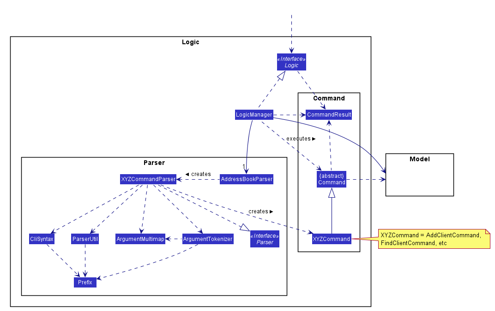

**How the architecture components interact with each other**

The *Sequence Diagram* below shows how the components interact with each other for the scenario where the user issues the command `cdel 1`.

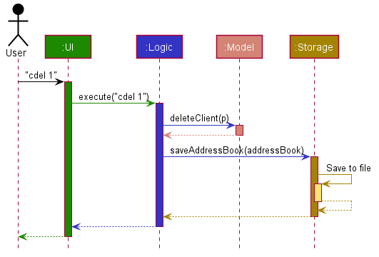

The sections below give more details of each component.

### UI component


**API** :
[`Ui.java`](https://github.com/AY2021S1-CS2103T-T13-3/tp/tree/master/src/main/java/seedu/address/ui/Ui.java)

The UI consists of a `MainWindow` that is made up of several parts e.g.`CommandBox`, `ResultDisplay`, `ClientListPanel`, `StatusBarFooter`, `Homepage` etc. All these, including the `MainWindow`, inherit from the abstract `UiPart` class.

The `UI` component uses JavaFx and ControlsFX UI framework. The layout of these UI parts are defined in matching `.fxml` files that are in the `src/main/resources/view` folder. For example, the layout of the [`MainWindow`](https://github.com/AY2021S1-CS2103T-T13-3/tp/tree/master/src/main/java/seedu/address/ui/MainWindow.java) is specified in [`MainWindow.fxml`](https://github.com/AY2021S1-CS2103T-T13-3/tp/tree/master/src/main/resources/view/MainWindow.fxml)

The `UI` component interacts with these external API: 

* `Logic` : Performs the Execution of user's commands.
* `Model` : Listens for changes to data so that the UI can be updated with the modified data.

### Logic component


**API** :
[`Logic.java`](https://github.com/AY2021S1-CS2103T-T13-3/tp/tree/master/src/main/java/seedu/address/logic/Logic.java)

1. `Logic` uses the `AddressBookParser` class to parse the user command.
1. This results in a `Command` object which is executed by the `LogicManager`.
1. The command execution can affect the `Model` (e.g. deleting a Client).
1. The result of the command execution is encapsulated as a `CommandResult` object which is passed back to the `Ui`.
1. In addition, the `CommandResult` object can also instruct the `Ui` to perform certain actions, such as displaying help to the user.

Given below is the Sequence Diagram for interactions within the `Logic` component for the `execute("cdel 1")` API call.


<div markdown="span" class="alert alert-info">:information_source: **Note:** The lifeline for `DeleteClientCommandParser` and `DeleteClientCommand` should end at the destroy marker (X) but due to a limitation of PlantUML, the lifeline reaches the end of diagram.
</div>

### Model component

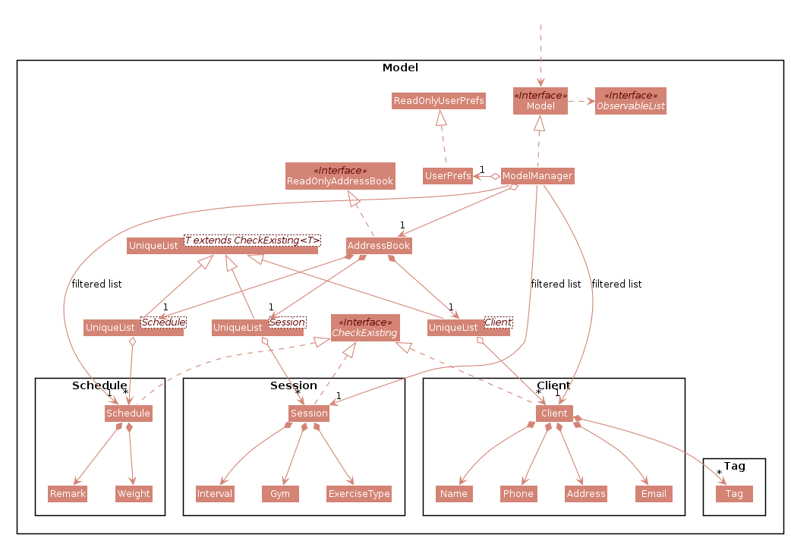

The figure above gives the overall architecture of the Model component.

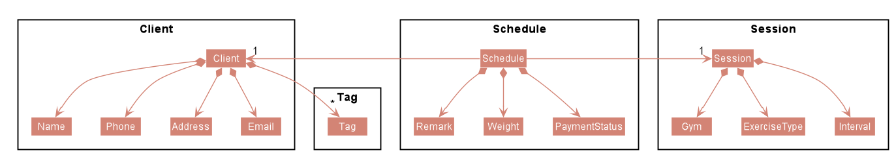

The figure above gives a more detailed class diagram for each of the Client, Session and Schedule packages.

**API** : [`Model.java`](https://github.com/AY2021S1-CS2103T-T13-3/tp/tree/master/src/main/java/seedu/address/model/Model.java)

The `Model`,

* stores a `UserPref` object that represents the user’s preferences.
* stores the address book data.
* exposes an unmodifiable `ObservableList<Client>` that can be 'observed' e.g. the UI can be bound to this list so that the UI automatically updates when the data in the list change.
* does not depend on any of the other three components.


### Storage component


**API** : [`Storage.java`](https://github.com/AY2021S1-CS2103T-T13-3/tp/tree/master/src/main/java/seedu/address/storage/Storage.java)

The `Storage` component,
* can save `UserPref` objects in json format and read it back.
* can save the address book data in json format and read it back.

### Common classes

Classes used by multiple components are in the `seedu.addressbook.commons` package.

--------------------------------------------------------------------------------------------------------------------

## **Implementation**

This section describes some noteworthy details on how certain features are implemented.

### Logging

We are using `java.util.logging` package for logging. The `LogsCenter` class is used to manage the logging levels 
and logging destinations.

- The logging level can be controlled using the `logLevel` setting in the configuration file 
(See [Section 3.2](#configuration), “Configuration”)
- The `Logger` for a class can be obtained using `LogsCenter.getLogger(Class)` which will log messages according 
to the specified logging level
- Currently log messages are output through both `Console` and to a `.log` file.

**Logging Levels**

- **SEVERE** : Critical problem detected which may possibly cause the termination of the application
- **WARNING** : Can continue, but with caution
- **INFO** : Information showing the noteworthy actions by the App
- **FINE** : Details that is not usually noteworthy but may be useful in debugging 
e.g. print the actual list instead of just its size


### Configuration

Certain properties of the application can be controlled(e.g. user prefs file location, logging level), 
through the configuration file (default: `config.json`)

### Edit Session feature

The proposed Edit Session mechanism is facilitated by `Addressbook`.

These operation is exposed in the `Model` interface as `Model#setSession()`.

Given below is an example usage scenario and how the Edit Session mechanism behaves at each step.

Step 1. The user launches the application for the first time.
The `AddressBook` will be initialized with the initial client, session and schedule list.

Step 2. The user executes `sedit 1 g/coolgym` command to edit the first Session in the address book. 
The `sedit` command calls `Model#setSession()`, causing changes to be made in the address book after the `sedit 1 g/coolgym` command executes.

The following sequence diagram shows how the Edit Session operation works:

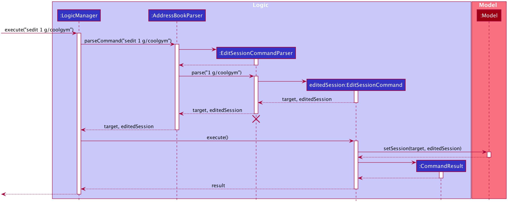

<div markdown="span" class="alert alert-info">:information_source: **Note:** The lifeline for `EditSessionCommand` should end at the destroy marker (X) but due to a limitation of PlantUML, the lifeline reaches the end of diagram.

</div>

The following activity diagram summarizes what happens when a user executes a new `EditSession` command, with the assumption that the user inputs a valid command:

<figure style="width:auto; text-align:center; padding:0.5em; font-style: italic; font-size: smaller;">
    <p>
        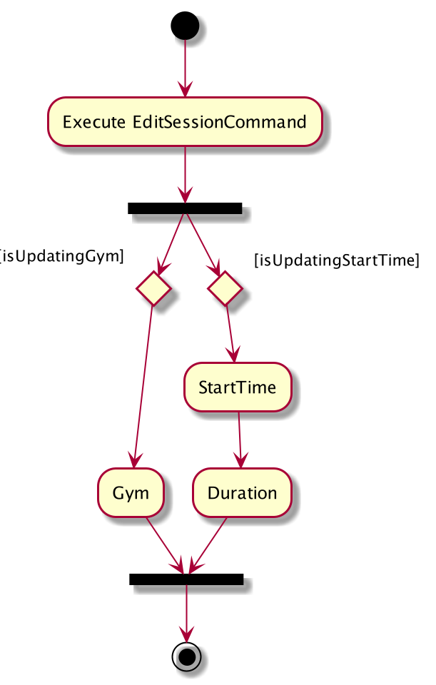
    </p>
    <figcaption>Figure - Edit Session Activity Diagram</figcaption>
</figure>

### Delete Session feature

The Delete Session feature allows user to cancel a Session, and delete all Schedules associated to the Session.

#### Implementation

The Delete Session mechanism is facilitated by `DeleteSessionCommand` which extends `Command`. The format of the 
command is given by: 

```sdel INDEX [f/]```

When using this command, the `INDEX` should refer to the index shown in the Session List on the right panel.
The user can follow up with an optional force parameters to delete all Schedules associated to the Session.

These delete operations are exposed in the `Model` interface as `Model#deleteSession`, `Model#deleteSessionAssociatedSchedules`
and `Model#hasAnyScheduleAssociatedWithSession`.

The following activity diagram summarizes what happens when a user executes a new `DeleteSession` command, with the assumption that the user inputs a valid command.

<figure style="width:auto; text-align:center; padding:0.5em; font-style: italic; font-size: smaller;">
    <p>
        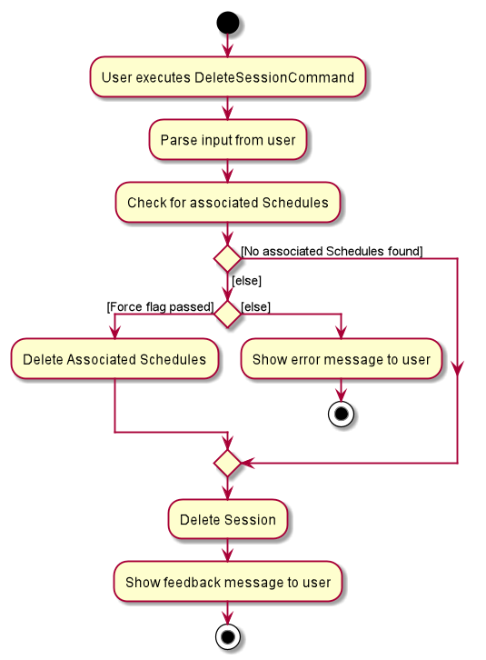
    </p>
    <figcaption>Figure - Delete Session Activity Diagram</figcaption>
</figure>

The following diagram shows a possible application state in FitEgo. 

<figure style="width:auto; text-align:center; padding:0.5em; font-style: italic; font-size: smaller;">
    <p>
        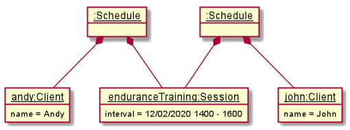
    </p>
    <figcaption>Figure - A possible application state</figcaption>
</figure>

In the following sequence diagram, we trace the execution when the user decides to enter the Delete Session command 
`sdel 1 f/` into FitEgo with the above scenario, where the first Session in the Session List is the `enduranceTraining` Session. 
For simplicity, we will refer to this command input as `commandText`. 

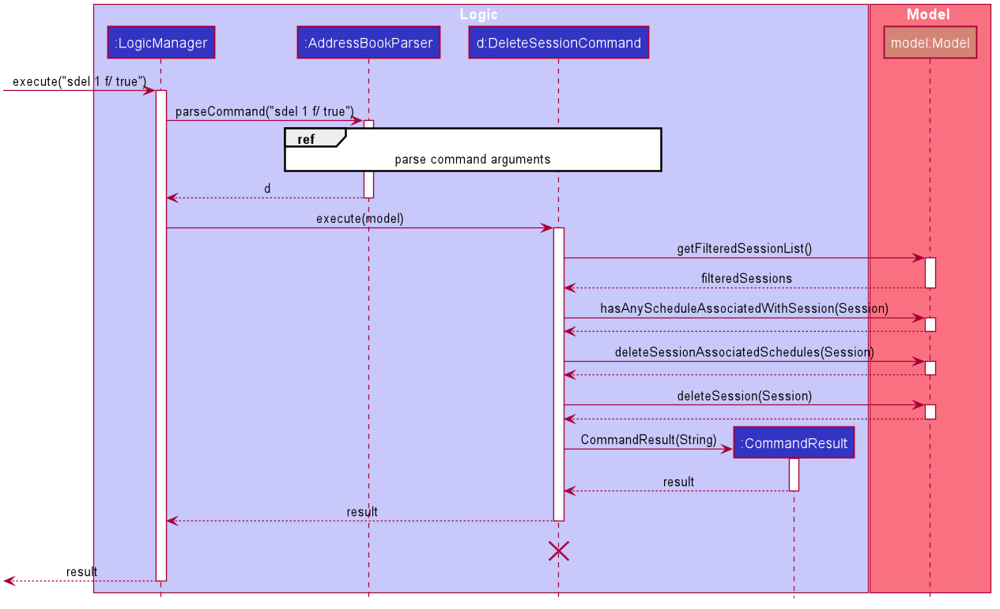

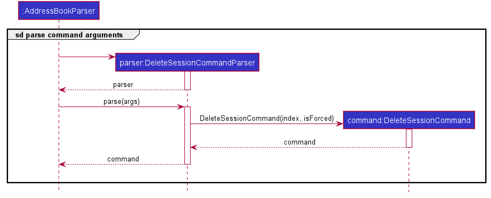
 
<div markdown="span" class="alert alert-info">:information_source: **Note:** The lifeline for `DeleteSessionCommand` 
should end at the destroy marker (X) but due to a limitation of PlantUML, the lifeline reaches the end of diagram.
</div>

The sequence diagram above shows how the `DeleteSessionCommand` is executed in FitEgo. The LogicManager receives user 
command as commandText and parses it with `AddressBookParser`. It will parse the command and pass the remaining
arguments to `DeleteSessionCommandParser` to construct a `DeleteSessionCommand`. This `DeleteSessionCommand` is 
returned to the `LogicManager` which will then executes it with reference to the model argument.

The model will first get the current `FilteredSessionList` instance to get the Session to be deleted. It will then check
whether there exist any `Schedule` associated to the Session. As there are currently 2 schedules associated to the "enduranceTraining" session in FitEgo and the boolean `isForced` 
is set to true, the model will remove them from `AddressBook`. It will then create a `CommandResult` to relay feedback 
message back to the UI and return control back to `LogicManager`. It will persist these changes by saving it to the storage.

#### Design Considerations

In designing this feature, we had to consider several alternative ways in which we can choose to handle session deletion.

- **Alternative 1 (current choice):** Delete Session only after all associated Schedules are deleted.
    
    - Pros: 
        1. Easier to maintain data integrity.
    - Cons:
        1. Extra logic inside the method implementation.
        2. May have performance issues in terms of response time if there are a lot of Schedules or Sessions stored in FitEgo.
    
- **Alternative 2:** Mark Session as deleted and treat Schedules with deleted Session as invalid
    
    - Pros: 
        1. Easier to implement the method. 
        2. No need to handle additional force flag option.
    - Cons: 
        1. We must keep track of deleted Sessions, which might bloat up the application over time.
        2. Harder to maintain data integrity over time.
        
- **Alternative 3:** Delete the Session without checking for associated Schedules

    - Pros: Easy to implement.
    - Cons: A Schedule might have invalid Session, breaking data integrity.


### Add Schedule feature

The Add Schedule feature allows user to create a Schedule associated with a Client and a Session. 
In other words, it allows user to schedule a Client to a Session.

#### Implementation

The Add Schedule mechanism is facilitated by `AddScheduleCommand` which extends `Command`. The format of the 
command is given by: 

```schadd c/CLIENT_INDEX s/SESSION_INDEX```

When using this command, the `CLIENT_INDEX` should refer to the index shown in the Client List on the left panel, and is used to specify the Client. The `SESSION_INDEX` should refer to the index shown in the Session List on the right panel, and is used to specify the Session.

The following activity diagram summarizes the decision making process when a user executes a new `AddSchedule` command.

 <figure style="width:auto; text-align:center; padding:0.5em; font-style: italic; font-size: smaller;">
     <p>
         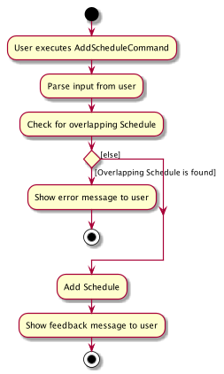
     </p>
     <figcaption>Figure - Add Schedule activity diagram</figcaption>
 </figure>

#### Command Usage Examples

Assume the current state of the displayed Client List, displayed Session List, and Schedules (all Schedules in FitEgo) are as illustrated on the following simplified object diagram:

 <figure style="width:auto; text-align:center; padding:0.5em; font-style: italic; font-size: smaller;">
     <p>
         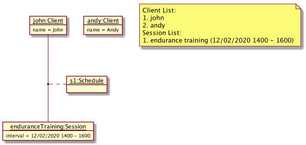
     </p>
     <figcaption>Figure - Sample current state of Add Schedule</figcaption>
 </figure>

Now, consider two cases of Add Schedule command to be invoked.

**Case 1**:  `schadd c/2 s/1`

Here is what happens when `schadd c/2 s/1` is invoked.

The overall mechanism is similar to [Delete Session](#delete-session-feature), but mainly differs on the method call `parseCommand` and `DeleteSessionCommand#execute(model)`.

`parseCommand` method call:
Instead of using `DeleteSessionCommandParser`, it uses `AddScheduleCommandParser` such that it returns an `AddScheduleCommand` object called `a` with Client index `2` and Session index `1`.

`AddScheduleCommand#execute(model)` will be called instead of `DeleteSessionCommand#execute(model)`:
This method call can be traced by the following sequence diagram snippet.

 <figure style="width:auto; text-align:center; padding:0.5em; font-style: italic; font-size: smaller;">
     <p>
         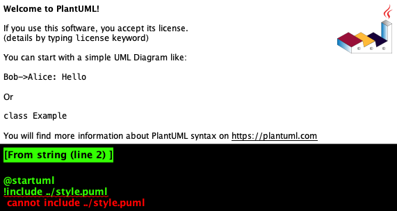
     </p>
     <figcaption>Figure - Sequence diagram snippet for <code>AddScheduleCommand#execute(model)</code></figcaption>
 </figure>
 
As shown in the figure above, first it gets the Client and Session from the filtered (displayed) lists. Then, it checks for existing identical Schedule (Schedule that consists of the same Client and Session) using `hasAnyScheduleAssociatedWithClientAndSession()`. 
Since for this case it is not found, then create a new Schedule object and add it into the Model using `Model#addSchedule()`. Finally, return the CommandResult to indicate a success.

Thus, `schadd c/2 s/1` will add a Schedule associated with Andy (the second Client in the Client List) and endurance training from 12/12/2020 1400 - 1600 (the first Session in the Session List). The result can be illustrated by the following object diagram, which creates a new Schedule:

 <figure style="width:auto; text-align:center; padding:0.5em; font-style: italic; font-size: smaller;">
     <p>
         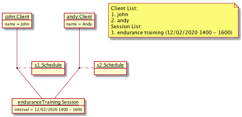
     </p>
     <figcaption>Figure - Result of invoking <code>schadd c/2 s/1</code></figcaption>
 </figure>

**Case 2:** `schadd c/1 s/1`

On the other hand, invoking `schadd c/1 s/1` will result in an error shown to the user as an identical Schedule already exists. Here, John is already scheduled to the endurance training Session from 12/12/2020 1400 - 1600.

### Edit Schedule feature

The proposed Edit Schedule mechanism is facilitated by `Addressbook`, similar to the Edit Session Command.

This operation is exposed in the `Model` interface as `Model#setSchedule()`.

Similar to the Edit Session mechanism, the example usage scenario below shows how Edit Schedule mechanism behaves:

The user executes `schedit c/1 s/1 us/2` command to edit the Schedule with the first Session and first Client in the address book. 
The `schedit` command calls `Model#setSchedule()`, causing changes to be made in the address book after the `schedit c/1 s/1 us/2` command executes.

The following activity diagram summarizes what happens when a user executes a new `EditSchedule` command, with the assumption that the user inputs a valid command:

<figure style="width:auto; text-align:center; padding:0.5em; font-style: italic; font-size: smaller;">
    <p>
        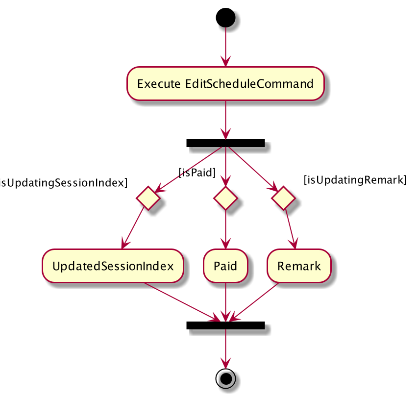
    </p>
    <figcaption>Figure - Edit Schedule Activity Diagram</figcaption>
</figure>

#### Design consideration:

##### Aspect: How edit schedule executes

* **Alternative 1 (current choice):** Retrieve Schedule using Client and Session Index.
  * Pros: Clearer to retrieve.
  * Cons: Require user to know the Client and Session Index separately.

* **Alternative 2:** Retrieve Schedule using Schedule Index
  itself.
  * Pros: Easier to retrieve.
  * Cons: Implementation is more confusing as User there's a conflict between Index and user-typed String index.


### View Client's Weight feature

The viewing of client's weight feature allows the user to check in on a Client's progress after multiple Sessions.
This data is important because it allows the user to check the effectiveness of his training schedule and customise the training 
based on the remarks and weight progress. 

Viewing of Client's Weight is accessible when the user calls `cview [INDEX]` followed by activating the `Weight` tab pane. 

#### Implementation

The recording of weight is stored in `Schedule` class. This is because we believe that trainer would optionally take a weight measurement
at the start of every session. Thus, to get the weight change over time, a list of schedules related to the `Client` has to be extracted. 

In the following sequence diagram, we trace the execution starting from when the user calls `cview 1` until when the UI is updated with Client View.

<figure style="width:auto; text-align:center; padding:0.5em; font-style: italic; font-size: smaller;">
    <p>
        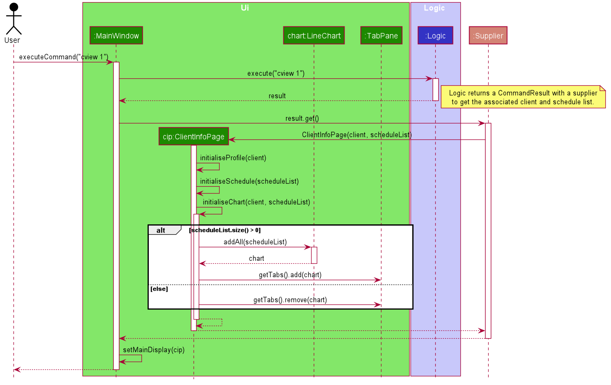
    </p>
    <figcaption>Figure - Client View Weight Generate Sequence Diagram</figcaption>
</figure>

<div markdown="block" class="alert alert-info"> 

:information_source: **Note:**

The steps used to create CommandResult is omitted in the sequence diagram for clarity of diagram. The return object of `logic.execute("cview 1")`
is a CommandResult object, within which, contains a Supplier which returns a Pane for MainWindow to display when activated.

</div>

As shown in the "alt" frame, the chart is added into the tab pane if there are associated schedule and the weight (if present within the `Schedule` object)
will be added into the line chart. Otherwise, the `Weight` tab will be removed instead of showing an empty chart.  

#### Design Considerations
In designing this weight tracking feature, we had considered several alternative ways in which we can store and retreive the weight. 

* **Alternative 1 (current choice):** Stores the `Weight` within the `Schedule` object
  * Pros: The user can track the weight against each session attended. 
  * Cons: Multiple weight measurement during a session, and weight measurement without a session cannot be entered. 
  
* **Alternative 2:** Stores a list of `Weight` within the `Client` object
  * Pros: Do not require a schedule in order to track weight. 
  * Cons: Lesser information about the weight (schedule's exercise, remarks, time, etc) is stored.  

--------------------------------------------------------------------------------------------------------------------

## **Documentation, logging, testing, configuration, dev-ops**

* [Documentation guide](Documentation.md)
* [Testing guide](Testing.md)
* [Logging guide](Logging.md)
* [Configuration guide](Configuration.md)
* [DevOps guide](DevOps.md)

--------------------------------------------------------------------------------------------------------------------

## **Appendix: Requirements**

### Product scope

**Target user profile**:
* is a fitness instructor who has trouble managing a significant number of clients and sessions
* prefers desktop apps over other types
* favours an All-in-One software over multiple apps
* can type fast
* prefers typing to mouse interactions
* is reasonably comfortable using CLI apps while appreciates a nice GUI that can show his weekly schedule
* prefers a simple and minimalistic view, as he does not like clutters.

**Value proposition**: to help a fitness instructor keeps track of his customers easily, via CLI as he’s a fast typer.
He can spend more time on his clients/his routine rather than manually using alternative software like Excel to track
administrative matters.


### User stories

Priorities: High (must have) - `* * *`, Medium (nice to have) - `* *`, Low (unlikely to have) - `*`

| Priority | As a ...                                     | I want to ...                    | So that I can ...                                                         |
| -------- | ------------------------------------------ | ------------------------------ | ---------------------------------------------------------------------- |
| `* * *`  | new trainer                                   | see usage instructions         | refer to instructions when I forget how to use the App                 |
| `* * *`  | trainer                                       | add a new client               |                                                                        |
| `* * *`  | trainer                                       | edit a client                  | change the details of a client                                         |
| `* * *`  | trainer                                       | view a client's detail         | view at all of the client's details at a glance                        |
| `* * *`  | trainer                                       | delete a client                | remove entries that I no longer need                                   |
| `* * *`  | trainer                                       | find a client by name          | locate details of clients without having to go through the entire list |
| `* * *`  | trainer                                       | tag my client         | I know their allergy / injury history and can advise them an appropriate training / diet schedule |
| `* * *`  | trainer                                       | create a Session               |                                                                        |
| `* * *`  | trainer                                       | edit a session                 | change the details of a session                                        |
| `* * *`  | trainer                                       | view a session's detail        | view at all of the session's details at a glance                       |
| `* * *`  | busy fitness trainer                          | filter sessions by time        | view only the upcoming or other important sessions                             |
| `* * *`  | trainer                                       | delete a session               | cancel all schedules if there is an urgent need                        |
| `* * *`  | trainer                                       | add a new schedule             |                                                                        |
| `* * *`  | trainer                                       | edit a schedule                | change the details of a schedule                                       |
| `* * *`  | trainer                                       | view a schedule's detail       | view at all of the schedule's details at a glance                      |
| `* * *`  | trainer                                       | delete a schedule              | remove schedule that are cancelled or completed                        |
| `* *`    | trainer                                       | hide private contact details   | minimize chance of someone else seeing them by accident                |
| `* *`    | forgetful fitness trainer                     | track clients' payments        | remind those who have not paid up                                      |
| `* *`    | busy fitness trainer                          | query if a particular time slot is open     | add new clients to that time slot                         |
| `* *`    | fitness trainer                               | track clients' weight over time| keep track of my clients progress over time                            |
| `* *`    | fitness trainer                               | store clients' session feedback| utilise previous sessions and plan exercises for upcoming sessions     |
| `*`      | trainer with many clients in the address book | sort clients by name           | locate a client easily                                                 |
| `*`      | user                                          | change software background between light and dark mode | customise my experience                        |
| `*`      | trainer focused on coaching pre-NS teen       | track client's date of birth   | adjust the fitness intensity depending on IPPT period                  |


### Use cases

(For all use cases below, the **System** is the `FitEgo` and the **Actor** is the `user`, unless specified otherwise)


**Use case: UC01 Add a Client**

**MSS**

 1.  User requests to add a specific Client in the list
 2.  FitEgo adds the Client.
Use case ends.
    
**Extensions**

* 1a. The client is within the list.
    
    * 1a1. FitEgo shows an error message.

      Use case ends.
      
* 1b. The Session is missing some required details.

    * 1b1. FitEgo shows an error message.
    
       Use case ends.
       

<br/>

**Use case: UC02 Edit a Client**

**MSS**

 1.  User requests to list Clients
 2.  FitEgo shows a list of Clients
 3.  User requests to edit a specific Client in the list
 4.  FitEgo edits the Client according to the specified details
Use case ends.

**Extensions**

* 2a. The list is empty.

  Use case ends.

* 3a. The given index is invalid.

    * 3a1. FitEgo shows an error message.

      Use case resumes at step 2.  
<br/>

**Use case: UC03 Delete a Client**

**MSS**

 1.  User requests to list Clients
 2.  FitEgo shows a list of Clients
 3.  User requests to delete a specific Client in the list
 4.  FitEgo deletes the Client
Use case ends.

**Extensions**

* 2a. The list is empty.

  Use case ends.
  
* 2b. User requests to force delete a specific Client in the list.

    * 2b1. FitEgo force deletes the Client and its associated Schedules.
  
    Use case ends.

* 3a. The given index is invalid.

    * 3a1. FitEgo shows an error message.

      Use case resumes at step 2.

* 3b. The given index refers to a Client associated with one or more Schedule.
    
    * 3b1. FitEgo shows an error message.
    
      Use case resumes at step 2.
      
<br/>

**Use case:  UC04 Find Clients**

**MSS**

 1.  User requests to find some Client based on keyword or text.
 2.  FitEgo displays the Client's whose name matches the keyword or text.
Use case ends.

**Extensions**

* 2a. The search result is empty.
    2a1. FitEgo displays no clients found.

  Use case ends.

<br/>

**Use case: UC05 View a Client**

**MSS**

 1.  User requests to list Clients.
 2.  FitEgo shows a list of Clients.
 3.  User requests to view a specific Client in the list
 4.  FitEgo opens the Client's profile in a new window.
Use case ends.

**Extensions**
* 2a. The list is empty.

  Use case ends.

* 3a. The given index is invalid.

    * 3a1. FitEgo shows an error message.

      Use case resumes at step 3.

* 4a. Previous Client's profile window is not closed.
    * 4a1. The previous Client's profile will be closed.
    * 4a2. The current Client's profile will be displayed.

      Use case ends.
      
<br/>

**Use case: UC06 Add a Session**

Similar to <u>UC01 (Add a Client)</u>, but replace Client with Session.

<br>
      
**Use case: UC07 Edit a Session**

Similar to <u>UC02 (Edit a Client)</u>, but replace Client with Session.

<br>

**Use case: UC08 Delete a Session**

Similar to <u>UC03 (Delete a Client)</u>, but replace Client with Session.

<br/>

**Use case: UC09 View Session within time period**

**MSS**

 1.  FitEgo shows a list of Sessions.
 2.  User requests to filter the Session List by a period.
 3.  FitEgo filters the Session List according to the specified period and updates its title.
Use case ends.

**Extensions**

* 1a. The list is empty.

  Use case ends.

* 2a. The given period is invalid.

    * 2a1. FitEgo shows an error message.

      Use case resumes at step 2.     
<br/>

**Use case: UC10 Add a Schedule**

**MSS**

 1. FitEgo shows a list of Clients and list of Sessions.
 2. User requests to add a specific Schedule between a specified Client from Client List and Session from Session List.
 3. FitEgo adds the Schedule.
Use case ends.

**Extensions**

- 2a. The Client index or Session index is invalid.

  - 2a1. FitEgo shows an error message.

    Use case resumes at step 2.
  
- 2b. The Schedule to be added is overlapping with another Schedule.

  - 2b1. FitEgo shows an error message.

    Use case resumes at step 2.  
<br/>

**Use case: UC11 Edit a Schedule**

**MSS**

 1.  FitEgo shows a list of Schedule
 2.  User requests to edit a specific Schedule in the list (i.e. updated Session index, update payment, update weight)
 3.  FitEgo edits the Schedule according to the specified details

Use case ends.

**Extensions**

* 1a. The list is empty.

  Use case ends.

* 2a. The given index is invalid or request to schedule is absent.

    * 2a1. FitEgo shows an error message.

      Use case resumes at step 2.
      
<br/>

**Use case: UC12 Delete a Schedule**

**MSS**

 1. FitEgo shows a list of Clients and list of Sessions.
 2. User requests to delete a Schedule associated with a specified Client from the Client List and Session from the Session List.
 3. FitEgo deletes the Schedule.
 
Use case ends.

**Extensions**

- 2a. The Client index or Session index is invalid.

  - 2a1. FitEgo shows an error message.
  
    Use case resumes at step 2.

- 2b. There are no schedules with the specified Client and Session.

  - 2b1. FitEgo shows an error message.

    Use case resumes at step 2.  
<br/>

**Use case: UC13 Open User Guide in Browser**

**MSS**
 1.  User requests to view Help Window. 
 2.  FitEgo displays Help Window with the User Guide link.
 3.  User selects the link to access the User Guide. 
 4.  FitEgo opens the User Guide in user's default browser.
 
Use case ends.

**Extensions**
 - 3a. User closes the Help Window. 
    * 3a1. FitEgo closes the Help Window
	
      Use case ends.
        
<br/>

**Use case: UC14 Change Unit of Weight Graph**

**MSS**
1.  User requests to view Settings Window. 
2.  FitEgo displays Settings Window.
3.  User makes changes to settings. 
4.  FitEgo saves changes to settings. 

    Use case ends.

**Extensions**
* 2a. User closes the Settings Window. 
    * 2a1. FitEgo closes the Settings Window.
	
      Use case ends.

### Non-Functional Requirements

1.  Should work on any _mainstream OS_ as long as it has Java `11` or above installed.
2.  Should be able to hold up to 1000 clients and sessions without a noticeable sluggishness in performance for typical usage (respond to commands within 2 seconds).
3.  The application should be a single user product.
4.  A fitness instructor with above average typing speed for regular English text (i.e. not code, not system admin commands) should be able to accomplish most of the tasks faster using commands than using the mouse.
5.  The source code should be open source.
6.  The application should be usable without internet connection
7.  The user interface should be intuitive enough for users who are not IT-savvy
8.  The product can be downloaded freely from Github.
9.  The user should be able to read and modify the data files.
10.  The user should be able to use the application on different machines just by moving the data file
from your previous machine to your new machine.

### Glossary

* **API**: Application Programming Interface
* **Mainstream OS**: Windows, Linux, Unix, OS-X
* **CLI**: Command-Line Interface
* **GUI**: Graphical User Interface
* **json**: JavaScript Object Notation, a file format

--------------------------------------------------------------------------------------------------------------------

## **Appendix: Instructions for manual testing**

Given below are instructions to test the app manually.

<div markdown="span" class="alert alert-info"> 
:information_source: **Note:** These instructions only provide a starting point for testers to work on;
testers are expected to do more *exploratory* testing.
</div>

### Launch and shutdown

1. Initial launch

   1. Download the jar file and copy into an empty folder.

   1. Double-click the jar file Expected: Shows the GUI with a set of sample contacts. The window size may not be optimum.

1. Saving window preferences

   1. Resize the window to an optimum size. Move the window to a different location. Close the window.

   1. Re-launch the app by double-clicking the jar file.<br>
      Expected: The most recent window size and location is retained.

<div markdown="span" class="alert alert-info"> 
:information_source: **Note:** All index-based commands mentioned in the test cases below require the index to be greater than zero and smaller than the list size.

Otherwise, the expected outcome: No changes are made. Error details shown in the status message.
</div>

### Adding a Client

1. Adding a Client while all Clients are being shown

   1. Test case: `cadd n/David …` <br>
      Expected: First contact is added to the list. Details of the added contact shown in the status message.


### Adding a Session

1. Adding a Session while all Clients are being shown.

    1. Test case: `sadd g/Machoman Gym ex/Endurance at/29/09/2020 1600 t/120` <br>
       Expected: Session is added to the list, and it is shown in order. Details of the added Session shown in the status message.
       
    1. Other incorrect Add Session commands to try: 
        `sadd g/machoman ex/endurance at/29/09/2020 t/120` (wrong date format),
        `sadd g/machoman ex/endurance at/29/09/2020 1600 t/0` (invalid duration) <br>
       Expected: Session is not added. Error details are shown in the status message.

### Editing a Session

1. Editing a Session while all Sessions are being shown.

   1. Prerequisites: Multiple Sessions in the list can be viewed on the right panel of the GUI.
    
   1. Test case: `sedit 1 g/Machoman at/29/09/2020 1600 t/120`<br>
      Expected: First Session's gym location and timing is edited. Details of the edited Session is shown in the status message.
      
### Deleting a Session

1. Deleting a Session while all Sessions are being shown.

   1. Test case: `sdel 1 f/` <br>
       Expected: The 1st Session in the Session List will be deleted alongside all Schedules associated to the Session. Details of the deleted Session is shown in the status message.

### Viewing Sessions within Period

1. Viewing Sessions within Period while the Session List is non-empty.

   1. Prerequisites: Multiple Sessions in the list can be viewed on the right panel of the GUI.

   1. Test case: `sview p/+1d`<br>
      Expected: The right panel only displays Sessions with start time from 0000hrs today to 2359hrs the next day.
      Indication that Session List has been successfully updated is shown in the status message.

   1. Other incorrect View Session commands to try: `sview`, `sview p/+2s` (where unit of time is not d/m/y), `...` <br>
      Expected: View of Session List is unchanged. Error details shown in the status message.
      
### Adding a Schedule

1. Adding a Schedule while all Clients and Sessions are being shown.

   1. Prerequisites: Multiple Clients and Sessions in the list can be viewed on the left and right panel of the GUI respectively.
   
   1. Test case: `schadd c/1 s/1`<br>
      Expected: Add a Schedule associated with the first Client in the Client List and first Session in the Session List.
      Details of the added Schedule is shown in the status message.
      

### Editing a Schedule

1. Editing a Schedule while all Schedules are being shown.

   1. Prerequisites: Multiple Schedules in the list can be viewed on the main panel of the GUI.

   1. Test case: `schedit c/1 s/1 us/2 pd/paid r/text`<br>
      Expected: Edit Schedule with the first Client and first Session is edited to second Session in the Session List, with payment updated to paid and remarks updated to text.
      Details of the edited Schedule is shown in the status message.


### Deleting a Schedule

1. Deleting a Schedule while all Clients and Sessions are being shown.

   1. Prerequisites: Multiple Clients and Sessions in the list can be viewed on the left and right panel of the GUI respectively.
   
   1. Test case: `schdel c/1 s/1`<br>
      Expected: Delete the Schedule associated with first Client in the Client List and first Session in the Session List.
      Details of the deleted Schedule is shown in the status message.

### Saving data

1. Dealing with missing/corrupted data files

   1. Test case: Open `data/addressbook.json` and change one of the Schedule's `clientEmail` to an email that 
      does not exist inside the `clients` list.
      Expected: FitEgo notices an invalid storage format and start with an empty addressbook.
      
   2. Test case: Open `data/addressbook.json` and change one of the Schedule's `startTime` or `endTime` so that the
      resulting interval does not exist inside the Session List.
      Expected: Similar to previous.

