Welcome to FitEgo! This document will serve as a user guide to the all-in-one scheduling application.

Made with **fitness instructors** in mind, **FitEgo** is a **desktop program** that helps them **manage their clients and schedules**, optimized for use via a Command Line Interface (CLI) while still having the benefits of a Graphical User Interface (GUI). If you can type fast, **FitEgo** can get your client management tasks done faster than traditional GUI apps.

## Table of Contents

* Table of Contents
{:toc}

--------------------------------------------------------------------------------------------------------------------

# 1 Quick start

If this is your first time, here are some quick tips to get started.

1. Ensure you have [Java `11`](https://www.oracle.com/java/technologies/javase-jdk11-downloads.html) or above installed in your Computer.

1. Download the latest `FitEgo.jar` from [here](https://github.com/AY2021S1-CS2103T-T13-3/tp/releases).

1. Copy the file to the folder you want to use as the _home folder_ for your **FitEgo** program.

1. Double-click the file to start the app. The GUI similar to the figure below should appear in a few seconds. Note how the app contains some sample data. 
   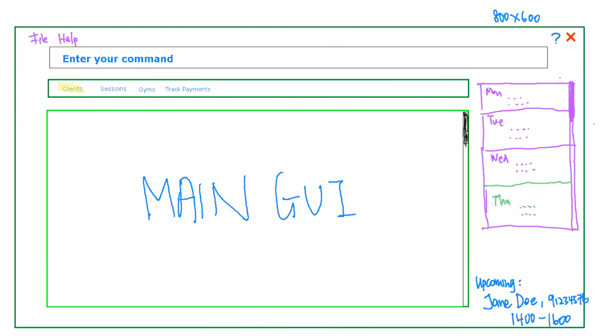
   
Figure 1 - Sample screenshot of our Ui

1. Type the command in the command box and press "Enter" key to execute it. e.g. typing **`help`** and pressing "Enter" key will open the help window. 
  Some example commands you can try:

   * **[`clist`](#321-listing-all-clients--clist)** : Lists all clients stored in **FitEgo**.

   * **[`cadd n/Jane Doe p/91234567 e/jane@gmail.com`](#322-adding-a-client--cadd)** : Adds a client named `Jane Doe` to the Client List.

   * **[`cdel 3`](#325-deleting-a-client--cdel)** : Deletes the third client shown in the Client List.

   * **[`exit`](#315-exiting-the-program--exit)** : Exits the app.

1. Read [Overview](#12-overview) for a quick understanding of commands in FitEgo.

1. Refer to the [Keyword](#31-main-keywords) below for more details of each command.

### 1.1 How to interpret notations

Below are a few examples of the common notations in this document in which the different backgrounds and icons represent different meanings.

[comment]: <> (Copy the blocks below and edit your message)

 

:information_source: **Note:**

Explains the rationale behind our design. 

[comment]: <> (This only appears in Github CSS)

:bulb: **Tip:**

Good to learn, but not necessary to know to use FitEgo. 

:star: **Feature:**

Important to know.

:heavy_check_mark: **Example:**

An example to follow. 

:warning: **Warning:**

May have irreversible effect when used. Backup and caution is recommended.

### 1.2 Overview

You're a fitness instructor.

You record your clients' details, training progress, payment status and your own timetable across 3 or 4 different applications.

You struggle to keep all of them updated.

You struggle even more to get insights out of them.

FitEgo can help you with that. Here's how:

FitEgo lets you record crucial information that you want to keep track of using three types of entities:

Item | Prefix | What it represents
-----|-------| -------------------
Client | c | Someone who is interested in or has engaged with your services
Session | s | Timeslot for a fitness session
Schedule | sch | A client's booking of a session

And here's what you can do:
1. When you find a client that is interested in your fitness training services, you can add him/her to your list of clients with the:  
[`cadd` command](#322-adding-a-client--cadd)
2. Next, create a fitness session on any free timeslot that you have with the:  
[`sadd` command](#331-adding-a-session--sadd)
3. And, schedule your client to the fitness session with the:  
[`schadd` command](#341-adding-a-schedule--schadd)

Simple? That's the point of FitEgo.

Now, you will probably need to edit, delete and look through your clients and sessions along the way - 
FitEgo supports all those features and more.

Ready to begin? Let's start exploring!
    
### 1.3 General Note

The program will automatically save after every command execution to guarantee that your data will never be lost.

--------------------------------------------------------------------------------------------------------------------

# 2 UI-orientation

You can refer to the table and the figure below to familiarize yourself with the user interface of FitEgo.

[comment]: <> (Why cant you figure out yourself?)

 <figure style="width:auto; text-align:center; padding:0.5em; font-style: italic; font-size: smaller;">
     

         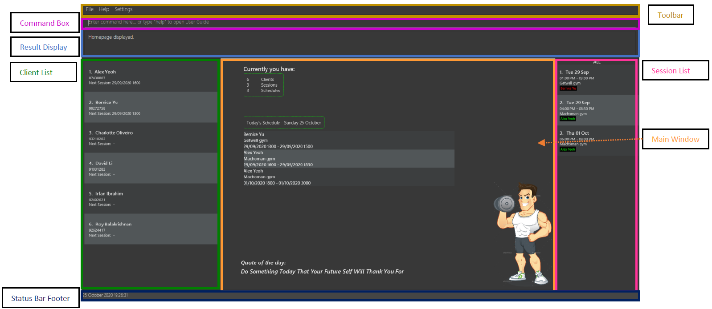
     

     <figcaption>Figure - Callouts of the various UI components</figcaption>
 </figure>
 

 Table 1 - Functions of UI Components 

From the figure above, the GUI is made up of several components. 

| Component | Description |
| --------------- | ---------------------------------------- | 
| Toolbar         | Displays the toolbar for this program. You can access the `exit` and `help` command from here.  | 
| Command Box     | Displays a text box for your input. You can type your command here.          | 
| Result Display  | Displays the result of your command. If the execution is successful, it will display a success message. Otherwise, it will prompt an error message | 
| Client List     | Displays the list of clients in a list view. You can modify this list using [client-related commands](#32-client-related-keywords) |
| Main Window     | Displays the main window of this program. It consists of the statistics of this program, today's schedule and quote of the day | 
| Session List    | Displays the list of your sessions in a list view. You can modify this list using [session-related commands](#33-session-related-keywords) | 
| Status Bar Footer | Displays the current date and time of the program. If you notice this is incorrect, your PC might be using a different timezone| 

:bulb: **Tip:**

You can type into the Command Box and it will display the commands that start with your current input.  
 

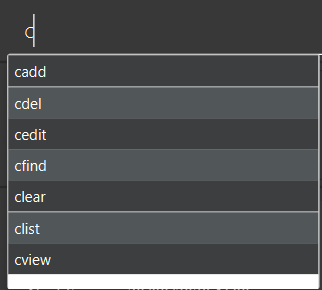
 
Figure 3 - Sample of autocomplete command

For example, in the above figure, if you enter `c` and commands that starts with "c" is displayed.  
For advanced users, you can use the "TAB" key and FitEgo will auto-complete the first suggestion into the command box, thus increasing your typing speed!   

--------------------------------------------------------------------------------------------------------------------

# 3 Keyword

In this section, you can find all the keywords that will help you fully utilize FitEgo.

**:information_source: Notes about the command format:** 

* Items are pairs of prefix and parameter.
  e.g. `n/NAME` is an item comprising prefix `n/` and parameter `NAME`.

* Words in `UPPER_CASE` are the parameters that you need to provide.
  e.g. in `add n/NAME`, `NAME` is a parameter which can be used as `add n/John Doe`.

* Items in square brackets are optional. 
  e.g `n/NAME [t/TAG]` can be used as `n/John Doe t/injured-thigh` or as `n/John Doe`.

* If a command only expects one item but receives multiple items of the same prefix, FitEgo will accept the last item.

* Items with `…`​ after them can be used multiple times including zero times. 
  e.g. `[t/TAG]…​` can be used as ` ` (i.e. 0 times), `t/injured-thigh`, `t/injured-thigh t/allergy-dairy` etc.

* Items can be in any order. 
  e.g. if the command specifies `n/NAME p/PHONE_NUMBER`, `p/PHONE_NUMBER n/NAME` is also acceptable.

This program has separated the keywords into 4 different categories - [Main](#31-main-keywords),
[Client](#32-client-related-keywords), [Session](#33-session-related-keywords) and [Schedule](#34-schedule-related-keywords).

## 3.1 Main Keywords
All main keywords are described in this section.

### 3.1.1 Viewing home : `home`

You can return to the home page by using this command. 

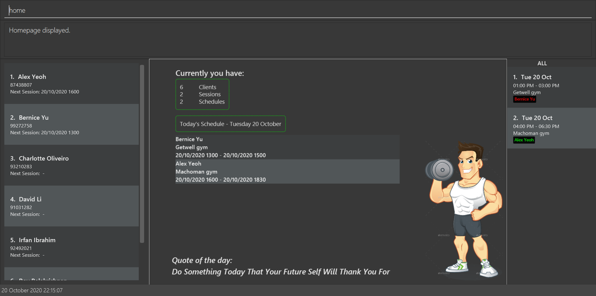

 Figure 4 - Homepage View 

The homepage will display the statistics of your program, today's schedule and quote of the day as shown in the figure above. 
If you do not have any planned schedules for the day, it will display `There are no schedules assigned today!`.  

:star: **Feature:**

If your session spreads over more than 1 day, the schedule will still be displayed if it intersects with today's date. 

### 3.1.2 Viewing help : `help`

You can ask FitEgo to open a window with a link to the help page as shown in the figure below.

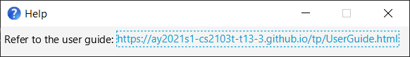

 Figure 5 - Help Window 

Format: `help`

:bulb: **Tip:**
By default, you can press "ENTER" key and a browser will open the User Guide. This pop-up window will close after you clicked on the link. 
Alternatively, you may press the "ESC" key to close this window. 

### 3.1.3 Viewing settings: `settings`

You can ask FitEgo to open a window to change user settings.

 Figure 6 - Settings Window 

Format: `settings`

:bulb: **Tip:**
Once the settings window is open, you can use arrow keys to toggle the options.
You may press "ESC" key to save your changes and close this window. You can press "F2" key anytime in the 
program to open the settings window too.  

The current settings available are:
 * preferred weight unit for graphs  
 *more to come!

### 3.1.4 Clearing all data in the program : `clear` 

You can delete all data (client, session, schedule) using the `clear` keyword. All of your existing data will be removed. 

 

:warning: **Warning:**

By using this command, you will delete all of your data, and by design of the system, it will be automatically saved. 
You will not be able to retrieve your previous data unless you have backed up the data file into an external location. 

### 3.1.5 Exiting the program : `exit`

You can exit the program using the `exit` command. Your data is saved automatically. 

Format: `exit`

### 3.1.6 Saving the data

Your data in FitEgo are saved in the hard disk automatically after any command that changes the data. There is no need to save manually.

---

## 3.2 Client-related Keywords

In this section, we will describe client-related keywords. Before that, let's define what we mean by client.
  

 

:information_source: **Client:**

A client is someone who is interested in or has engaged with your fitness training services. 

Each client must have a unique email.

Client-related commands will interact with the Client List which is located on the [left of the UI](#2-ui-orientation). 

 <figure style="width:auto; text-align:center; padding:0.5em; font-style: italic; font-size: smaller;">
     

         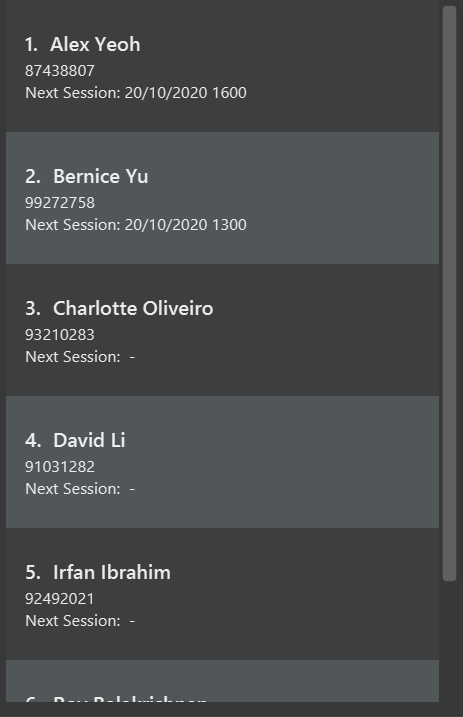
     

     <figcaption>Figure - Sample of Client List</figcaption>
 </figure>

 

:information_source: **Note:**

The Next Session field below each Client shows you the earliest upcoming session. It is not updated in real-time but after FitEgo executes a command.

### 3.2.1 Listing all Clients : `clist`

You can view the list of all clients in FitEgo. The list of clients will be shown at the Client List. 

By default, Client List will display all the clients. If you have used [`cfind`](#324-locating-clients-by-name--cfind) or any other commands to filter the Client List, 
you can use `clist` to view the entire list of clients.  

Format: `clist`

### 3.2.2 Adding a Client : `cadd`

You can add a client to the Client List including their details. This allows you to easily refer to their information when needed. 

Format: `cadd n/NAME p/PHONE_NUMBER e/EMAIL a/ADDRESS [t/TAG]`

Points to take note when adding a client's information:
* Email is unique for each client. This means you cannot add a new client if the email specified is already used by another client.

:bulb: **Tip:**
A client can have any number of tags (including 0). Each tag can include
alphanumeric characters or hyphen (`-`), but you are not allowed to start or end
a tag with a hyphen. 

:star: **Feature:**

You can add a profile picture to your client by storing their photo in a new folder named `images` within the `data` folder. You should name the photo 
as `profile-<client's full name in lowercase and separated by hyphen>.jpg`.   For example, if your client's name is Alex Yeoh, 
store his photo as `data/images/profile-alex-yeoh.jpg`

Examples:
* `cadd n/Jane Doe p/91234567 e/jane@gmail.com a/311, Clementi Ave 2, #02-25` adds a client with the specified name, phone number, email and address.
* `cadd n/John Doe p/91231367 e/jojo@gmail.com a/311, Clementi Ave 2, #02-25 t/injured-thigh` adds a client with the specified name, phone number, email, address and tag.

### 3.2.3 Editing a Client : `cedit`

If your client has any changes made to his details, then you can edit a client in the Client List. This helps you to reflect the latest information.

Format: `cedit INDEX [n/NAME] [p/PHONE] [e/EMAIL] [a/ADDRESS] [t/TAG]`

Points to take note when editing a client's information:
* Edits the client at the specified `INDEX`. The index refers to the index number shown in the displayed Client List. The index **must be a positive integer** 1, 2, 3, …​
* At least one of the optional fields must be provided.
* You cannot have multiple clients with the same email. This means you will get an error message if the email you specified here is already used by another client.
* Existing values will be updated to the input values.
* When editing tags, the existing tags of the client will be removed, i.e. adding of tags is not cumulative.
* You can remove all of the client’s tags by typing `t/` without specifying any tags after it.
* After performing a `cedit` command, you will see the updated client information page.

Examples:

*  `cedit 1 t/` removes all of the tags of the first client in the Client List
*  `cedit 2 p/12345678 t/injured-thigh` edits the phone number and tag of the second client in the Client List. As you can see in the figure below, both fields are updated after executing the command.

<figure style="width:auto; text-align:center; padding:0.5em; font-style: italic; font-size: smaller;">
    

        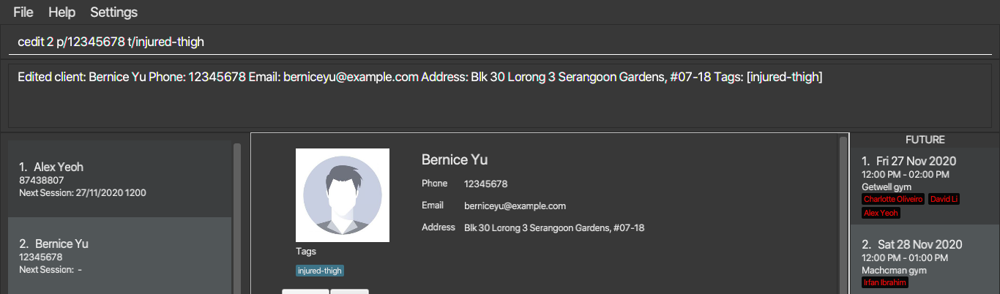
    

    <figcaption>Figure - Result of executing <code>cedit 2 p/12345678 t/injured-thigh</code></figcaption>
</figure>

### 3.2.4 Locating Clients by Name : `cfind`

You can find clients whose name contain any of the given keywords, and see the result in the Client List.

Format: `cfind KEYWORD [MORE_KEYWORDS]`

Points to take note when finding clients by name:
* The search is case-insensitive, e.g. `hans` will match `Hans`.
* The order of the keywords does not matter, e.g. `Hans Bo` will match `Bo Hans`.
* Only the name is searched.
* Partial names will be matched, e.g. `Han` will match `Hans`.
* Clients matching any substring will be returned (i.e. `OR` search),
  e.g. `Hans Bo` will return `Hans Gruber`, `Bo Yang`.

Examples:
* `cfind John` returns `john` and `John Doe`
* `cfind alex david` returns `Alex Yeoh`, `David Li` as shown in the figure below  

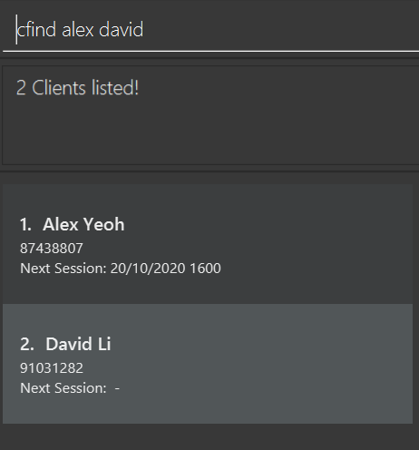

 Figure 8 - Result of finding clients by name 

### 3.2.5 Deleting a Client : `cdel`

If you are no longer taking up a client, you can delete the client which can be found in the Client List. This helps in reducing obsolete information.

Format: `cdel INDEX`

Points to take note when deleting a client from the Client List:
* Deletes the client at the specified `INDEX`.
* The index refers to the index number shown in the displayed Client List.
* The index **must be a positive integer** 1, 2, 3, …​

Examples:
* `clist` followed by `cdel 2` deletes the second client in the resulting Client List
* `cfind Bernice` followed by `cdel 1` deletes the first client with the name 'Bernice' in the resulting Client List
    * If Bernice is not associated with any schedule, Bernice's client information is immediately deleted
    * If Bernice is associated with one or more schedules, you will see a warning message about the conflict and how to force delete

:star: **Feature:**

- To force delete a client (and his associated schedules), pass in the optional force flag after the `INDEX`. 
Any string after the force flag (`f/`) will be ignored.

- If you perform [`cdel`](#325-deleting-a-client--cdel), you will be returned to the homepage.

* If there are one or more associated schedules associated with Bernice, `cfind Bernice` followed by `cdel 1 f/` will:
        1. Delete all schedules associated with Bernice
        2. Then, delete Bernice's client information.

### 3.2.6 Viewing a Client : `cview`

You can view the full details of a client from the Client List. 

You can easily look up the following information about the client in the Main Window:
* Your client's name, email, address, phone, tags
* Your client's weight history in line graph form
* A list of schedules associated with your client, together with the interval, exercise type and remark

Format: `cview INDEX`

Points to take note when viewing clients from the Client List:
* Views the client at the specified `INDEX`. The selected client will be displayed in the Main Window. 
* The index refers to the index number shown in the displayed Client List.
* The index **must be a positive integer** 1, 2, 3, ...
* You can press "F3" key to view your client's list of schedules, and "F4" key to view your client's weight progression.
* You can sort the list of schedules in the client's profile by the interval's start time, payment status or exercise type.

Examples:
* `cview 2` opens the second client in FitEgo
* `cfind Bernice` followed by `cview 1` opens the first client (Bernice) in the resulting Client List

 

The result of these commands is shown in the figure below

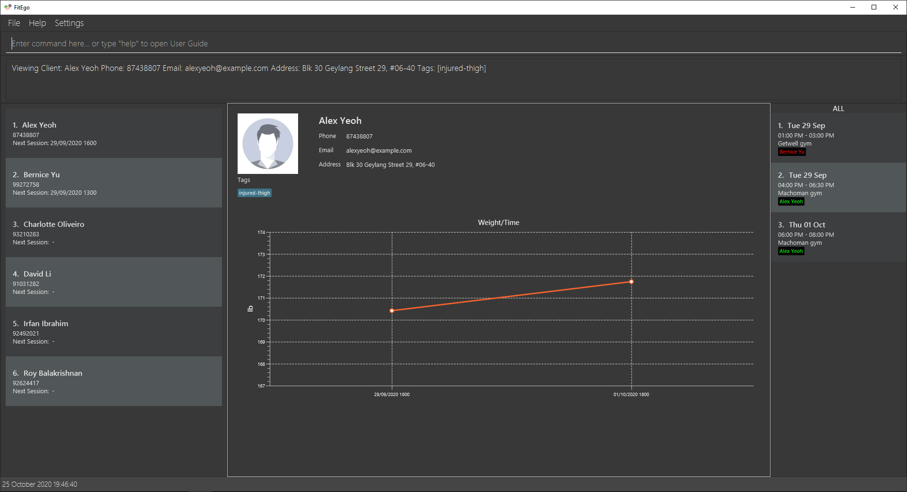

Figure 9 - Client View with Schedules 

---

## 3.3 Session-related Keywords 

We will describe all session-related keywords in this section. Before that, let's define what we mean by session.

 

:information_source: **Session:**

A session represents a timeslot that is marked for a training session. It contains information about the gym, the main exercise type, the start time and the duration of sessions.

Each session can be scheduled with multiple clients, to model a trainer instructing a group fitness class.

Session-related commands will interact with the Session List which is located on the [right of the UI](#2-ui-orientation). The figure below shows how it looks like.

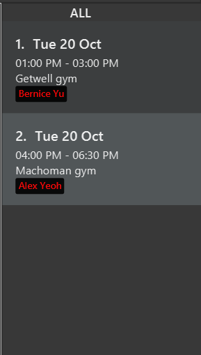 
Figure 10 - Sample of Session List
 
The `ALL` at the top of this Session List panel represents the current period of session view. 

:bulb: **Tip:**
The default period of session view is 'WEEK'. You can change the period 
of session view using [<code>sview</code>](#334-viewing-sessions-within-period--sview) command.
 

### 3.3.1 Adding a Session : `sadd`

You can create a session with its relevant details. If the new session is within the [viewing period](#334-viewing-sessions-within-period--sview) of the Session List, the addition will be reflected in the Session List.
This provides you with an easy reference to the periods in which you have session(s) scheduled and the location of each session.

Format: `sadd g/GYM_NAME ex/EXERCISE_TYPE at/START_TIME t/DURATION`

Points to take note when adding a session to the Session List:
* Start time should be of format "dd/MM/yyyy HHmm" (date/month/year Hour minutes in 24 hr format).
* Duration is in minutes.
* Duration should be a positive integer (larger than 0).
* If you want to schedule a session with a client, you need to make sure the session exists in FitEgo, then [create a schedule (`schadd`)](#341-adding-a-schedule--schadd) that references the client and the session.

 

:information_source: **Info:**

FitEgo will not allow you to create overlapping sessions. We consider two sessions as overlapping if another session starts before the current session ends.

This helps to prevent you from accidentally agreeing to 2 sessions that overlaps with each other but are located on two different gyms. 

<figure style="width:auto; text-align:center; padding:0.5em; font-size: smaller;">
    

        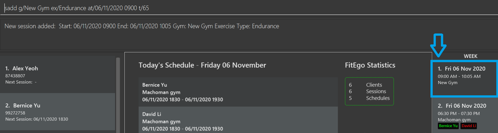
    

    <figcaption>Figure 11 - Result of executing <code>sadd g/New Gym ex/Endurance at/06/11/2020 0900 t/65</code></figcaption>
</figure>

Examples:
* `sadd g/New Gym ex/Endurance at/06/11/2020 0900 t/65` adds a session at gym `New Gym` with exercise type `Endurance` at `06/11/2020 0900hrs` that lasts for `65` minutes. 

### 3.3.2 Editing a Session : `sedit`

You can edit the details of the session identified by the index number used in the displayed Session List. This ensures that you can always record the latest changes.

Format: `sedit INDEX [g/GYM_NAME] [ex/EXERCISE_TYPE] [at/START_TIME t/DURATION]`

Points to take note when editing a session's details from the Session List:
* Edits the session at the specified `INDEX`. The index refers to the index number shown in the displayed Session List. The index **must be a positive integer** 1, 2, 3, …​
* `GYM_NAME` and `EXERCISE_TYPE` can be any words.
* `START_TIME` and `DURATION` convention follows the command `sadd`.
* At least one of the optional fields must be provided.
* Existing values will be updated to the input values.

Examples:
*  `sedit 1 g/Machoman at/29/09/2020 1600 t/120` edits the gym of the first session to be `Machoman` and the start time and duration to be `29/09/2020 1600 with a duration of 120  minutes` while keeping all other fields the same
*  `sedit 2 at/29/09/2020 1600 t/120` edits the start time and duration of the second session to be `29/09/2020 1600 with a duration of 120 minutes` while keeping all other fields the same

 
  
 Figure 12 - Result of executing <code>sedit 1 g/Machoman at/29/09/2020 1600 t/120</code>
 

### 3.3.3 Deleting a Session : `sdel`

You can delete the session specified by the index number used in the displayed Session List and all schedules associated with
the specified session. This helps you keep track of only sessions that are still relevant to you.

Format: `sdel INDEX [f/]`

Points to take note when deleting a session from the Session List:
* Deletes the session at the specified `INDEX`.
* The index refers to the index number shown in the displayed Session List.
* The index **must be a positive integer** 1, 2, 3, ...

Examples:
* If there are no schedules associated with the second session in the Session List, `sview p/all` followed by `sdel 2` deletes the second session
* If there are one or more associated schedules associated with the second session in the Session List, `sview p/all` followed by `sdel 2`, you will see an error message

:star: **Feature:**

To force deletion of session (and all associated schedules), pass in the optional force flag after the `INDEX`. 
    Any string after the force flag (`f/`) will be ignored.

* If there are one or more schedules associated with the second session, 
  `list` followed by `sdel 2 f/` will delete all schedules associated with the second session, then delete the session itself
  
  
### 3.3.4 Viewing Sessions within Period : `sview`
You can filter the Session List to view sessions within requested period. This helps you to prioritise your sessions as needed.

Format: `sview p/PERIOD`

Points to take note when viewing session from the Session List:
 * Filters the Session List to display sessions within the specified period.
 * On top of the Session List, you can find the type of the period you are viewing.
 * The recognized periods are as follows:
 
 
Table 2 - List of recognized periods 

 
 | Period | Sessions displayed |
 | -------- | -------- |
 | all| All sessions (including past ones)|
 | future | All sessions that have not started|
 | past | All sessions that have already ended|
 | week | All sessions within the next 7 days (inclusive of today)|
 | `+[x][unit]` | Sessions within next x time units|
 | `-[x][unit]` | Sessions within past x time units|
 
 
 * The recognized units are as follows:
 
Table 3 - List of recognized time units 

 
 | Unit | Time unit parsed |
 | -------- | -------- |
 | d / D | day |
 | w / W | week |
 | m / M | month |
 | y / Y| year |
  

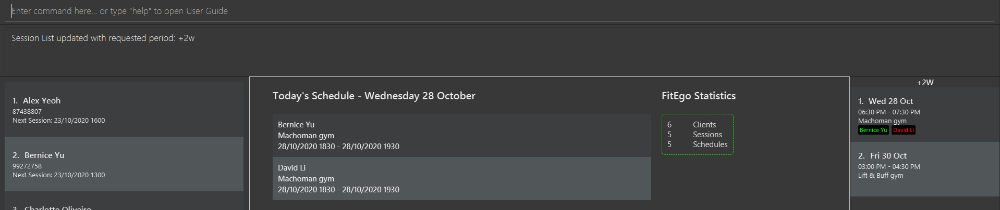 
Figure 13 - Result of running <code>sview p/+2w</code> 

Examples:
 
* `sview p/all` displays all sessions stored in FitEgo
* `sview p/+0D` displays all sessions today
* `sview p/-1d` displays all sessions from the past 1 day to today (yesterday and today)
* `sview p/+2w` displays all sessions from today to 2 weeks later. (e.g. If today is Friday, display from today to the Friday that falls 2 weeks later)

 

:information_source: **Note:**

The effect of `sview` is not updated in real-time but after FitEgo executes a command. For example, if you 
1. run <code>sview p/+0D</code> at 2359hrs on Friday
2. do not execute any command until 0000 hrs on Saturday

the Session List will still be showing Friday's sessions at that point of time. To update, simply run any command successfully in FitEgo.

---

## 3.4 Schedule-related Keywords 

In this section, we will describe all schedule-related keywords. Before that, let's define what we mean by schedule.

 

:information_source: **Schedule:**

A schedule records the interaction between you and your client within a session. 
Each schedule contains information about the client and the attended session. 

Listed below are three other types of information that you can add into a schedule:
1. your client's weight if you have recorded your client's weight during a session
1. exercises done by your client during the session as remark
1. your client's payment status on whether he has or has not paid for the session

The table below shows an example of schedules. The session at Machoman Gym is attended by 2 clients. For each client, we can take note of their weight, activities, and payment status. 

 Table 4 - Example of Schedule Tracking 

| Client   | Session                                                      | Weight | Remark                                                       | Payment Status |
| -------- | ------------------------------------------------------------ | ------ | ------------------------------------------------------------ | -------------- |
| John Doe | Endurance training at Machoman Gym (24/10/2020 1200 - 1400)  | 70 kg  | Planks (20 x 30 seconds), body weight squats (5 sets of 25 reps) | paid           |
| Alex | Endurance training at Machoman Gym (24/10/2020 1200 - 1400)  | 60 kg  | Planks (10 x 30 seconds) | unpaid           |
| Bernice  | Body building training at Getwell Gym (27/10/2020 1300 - 1500) | 85 kg  | Chinup (5 sets of 5 reps), muscle strain after bench press   | paid         |

To check if you have scheduled a session with a client, you can check if the session in the Session List contains the client's name. 

 <figure style="width:auto; text-align:center; padding:0.5em; font-style: italic; font-size: smaller;">
     

         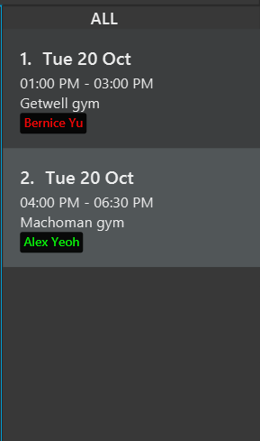
     

     <figcaption>Figure - Alternate sample of Session List</figcaption>
 </figure>

The figure above shows the Session List, in which for each session, there is a list of clients attending the session. Clients who have paid for a session will have their name shown in green, while those who have not  will have their name shown in red.

### 3.4.1 Adding a Schedule : `schadd`

You can schedule your client for a session. You can use this command to indicate that a client will attend one of your session.

Format: `schadd c/CLIENT_INDEX s/SESSION_INDEX`

Points to take note when adding a schedule:
* This will create a schedule associated with the specified client and session.
* The client is specified by `CLIENT_INDEX`, and the session is specified by `SESSION_INDEX`.
* `CLIENT_INDEX` refers to the index number shown in the Client List, and **must be a positive integer** 1, 2, 3, …
* `SESSION_INDEX` refers to the index number shown in the Session List, and **must be a positive integer** 1, 2, 3, …

Example:

* `schadd c/1 s/1` schedules the first client in the Client List with the first session in the Session List. As you can see in the figure below, Alex Yeoh (the fifth client, marked by the red square) is added to the first session in the list (marked by the blue square).

 <figure style="width:auto; text-align:center; padding:0.5em; font-style: italic; font-size: smaller;">
     

         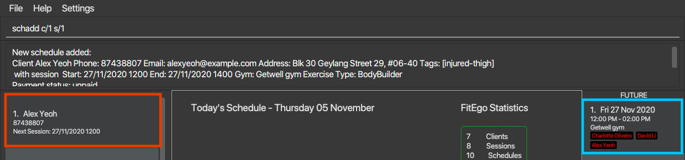
     

     <figcaption>Figure - Result of executing <code>schadd c/1 s/1</code></figcaption>
 </figure>

### 3.4.2 Editing a Schedule : `schedit`

If you want to change your client's session, payment status or remarks, you can edit the details of this schedule identified by the client index and session index.

Format: `schedit c/CLIENT_INDEX s/SESSION_INDEX [us/UPDATED_SESSION_INDEX] [pd/PAYMENT_STATUS] [r/REMARK] [w/WEIGHT]`

Points to take note when editing a schedule's details:
* Edits the schedule that consists of the client and session indicated by `CLIENT_INDEX` and `SESSION_INDEX`.
* `CLIENT_INDEX` refers to the index number shown in the Client List. The index **must be a positive integer** 1, 2, 3, …
* `SESSION_INDEX` and `UPDATED_SESSION_INDEX` refers to the index number shown in the Session List. The index **must be a positive integer** 1, 2, 3, …
* `PAYMENT_STATUS` can either be `paid` or `unpaid`.
* `REMARK` can be any words, phrases or sentences.
* `WEIGHT` must be **positive numbers** and **less than 1000kg**. By default, units will be set to kilogram. You can also add either `kg` or `lb` to the back to specify the units.
* At least one of the optional fields must be provided.
* Existing values will be updated to the input values.

Examples:

*  `schedit c/1 s/1 us/2` reschedules the first session in the Session List to the second session in the Session List while keeping all other fields the same
*  `schedit c/1 s/1 pd/paid` indicates that the first client in the Client List has paid for the second session in the Session List while keeping all other fields the same
*  `schedit c/1 s/1 r/did 5 pushups` edits the schedule containing client index 1 and session index 1 to have remark of doing 5 pushups while keeping all other fields the same
*  `schedit c/1 s/1 w/70` edits the schedule containing client index 1 and session index 1 to a weight of 70kg while keeping all other fields the same
* `schedit c/1 s/1 r/` clears the schedule containing client index 1 and session index 1 remarks while keeping all other fields the same

 
 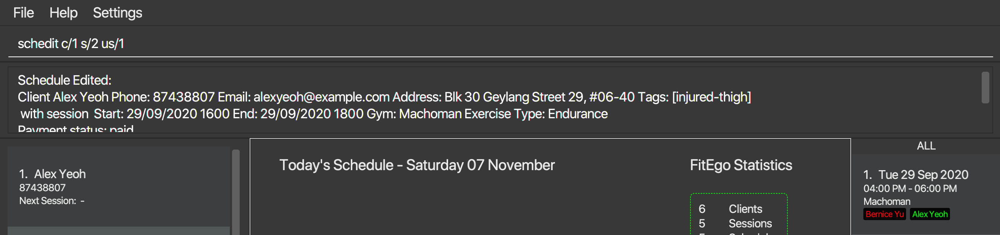 
 Figure 16 - Result of executing <code>schedit c/1 s/2 us/1</code>
 

### 3.4.3 Deleting a Schedule : `schdel`

You can delete a schedule associated with a client and session. You might want to use this command when a client decided to cancel attending a particular session.

Format: `schdel c/CLIENT_INDEX s/SESSION_INDEX`

Some points to take note when deleting a schedule:
* This will delete the schedule associated with the specified client and session.
* The client is identified by `CLIENT_INDEX`, and the Session is identified by `SCHEDULE_INDEX`.
* `CLIENT_INDEX` refers to the index number shown in the Client List. The index **must be a positive integer** 1, 2, 3, …
* `SESSION_INDEX` refers to the index number shown in the Session List. The index **must be a positive integer** 1, 2, 3, …

Examples:

* `schdel c/1 s/1` deletes the schedule associated with the first client in the Client List and first session in the Session List

--------------------------------------------------------------------------------------------------------------------

# 4 FAQ

**Q**: How do I transfer my data to another Computer?
**A**: Install the app in the other computer and overwrite the empty `data` folder it creates with your previous FitEgo `data` folder.

**Q**: I have encountered difficulties with FitEgo. May I know who do I reach out to for assistance?  
**A**: To get in touch with us, you may post an issue [here](https://github.com/AY2021S1-CS2103T-T13-3/tp/issues/new), and we will get back to you as soon as possible.

**Q**: Am I able to mark multiple schedules as paid or unpaid with one command?  
**A**: Currently, you are only able to mark only one schedule as paid or unpaid per command. This is a feature we are aiming to implement in the future.

**Q**: Is my data backed up to the internet?  
**A**: No, your data in FitEgo are saved in the hard disk. You will have to transfer the `data` folder, to whichever device you wish to continue using FitEgo on.

--------------------------------------------------------------------------------------------------------------------

# 5 Command Summary

You can find the comprehensive list of commands in the table below. 

Table 5 - General Commands Summary

| Action | Format |
| ---------| -------- |
| Open Home Page | `home` |
| Open Help Window | `help` |
| Open Settings Window | `settings` |
| Clear all data | `clear` |
| Exit this program | `exit` |

Table 6 - Keyword based Commands Summary (grouped by action) 

| Action | Entity | Format |
| ---------| -------- | -------- |
| Add | Client | `cadd n/NAME p/PHONE_NUMBER e/EMAIL [t/TAG]`|
| Add | Session | `sadd g/GYM_NAME ex/EXERCISE_TYPE at/START_TIME t/DURATION` |
| Add | Schedule |`schadd c/CLIENT_INDEX s/SESSION_INDEX`|
| Edit | Client | `cedit INDEX [n/NAME] [p/PHONE] [e/EMAIL] [a/ADDRESS] [t/TAG]`|
| Edit | Session |`sedit INDEX [g/GYM_NAME] [ex/EXERCISE_TYPE] [at/START_TIME t/DURATION]` |
| Edit | Schedule |`schedit c/CLIENT_INDEX s/SESSION_INDEX [us/UPDATED_SESSION_INDEX] [pd/PAYMENT_STATUS] [r/REMARK] [w/WEIGHT]`|
| Delete | Client |`cdel INDEX [f/]` |
| Delete | Session |`sdel INDEX [f/]` |
| Delete | Schedule |`schdel c/CLIENT_INDEX s/SESSION_INDEX` |
| List | All Clients | `clist`  |
| View | Client's Full Profile | `cview INDEX` |
| View | Sessions within Period |`sview p/PERIOD ` |
| Find | Client by Name | `cfind KEYWORD [MORE_KEYWORDS]` |

# 6 Acknowledgement
* This project uses libraries from [ControlsFX](https://github.com/controlsfx/controlsfx)
